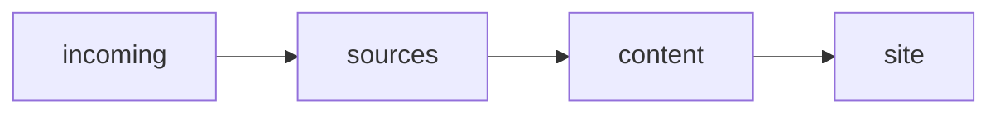

# Archive

Archive is a source-first documentation pipeline built around VitePress and Python workflow automation.

Archive supports two usage modes:

- standalone mode: clone `archive` and keep canonical content in that repo
- workspace mode: use the `archive` clone as tooling and keep canonical `incoming/` and `sources/` content in a separate repo

## What Archive Adds

Compared with plain VitePress, Archive adds:

- a canonical publishing pipeline: `incoming/ -> sources/ -> content/ -> site/`
- workflow-aware authoring for `note` and `doc`, with dynamic workflow discovery for future additions
- generated home, workflow, and tag index pages plus generated top-nav and sidebar data
- a knowledge panel with generated related links, backlinks, metadata, tag navigation, and local tag-search support such as exact `#tag` and prefix `#tag*`
- an intake and review flow for rough imported Markdown before it becomes canonical content
- workspace mode, where canonical content lives in a separate repo while generated output stays in the Archive tool repo
- instance-scoped generated output via `ARCHIVE_INSTANCE` so one Archive clone can serve multiple workspaces concurrently
- source-adjacent asset copying and built-in Mermaid fence rendering in the local theme

## Quickstart

Archive supports two first-run paths. Start with standalone mode unless your canonical content should live in a separate repo.

### Standalone Mode

Use this when you want the simplest out-of-the-box workflow.

```sh
git clone https://codeberg.org/rch/archive
cd archive
make install
make check
make dev-bg
```

Then open `http://localhost:5173`.

The public repo ships a tiny starter corpus under `sources/notes/examples/` and `sources/docs/examples/` so the first build shows real content, local assets, Mermaid rendering, and knowledge-panel links.
Delete those two `examples/` directories and run `make build` if you want to start from a blank standalone corpus.

### Workspace Mode

Use this when canonical docs and notes should stay in a separate repo while Archive remains the tooling repo.

```sh
git clone https://codeberg.org/rch/archive ~/tools/archive
mkdir -p ~/repos/my-notes

make -C ~/tools/archive WORKSPACE=~/repos/my-notes init-workspace
make -C ~/tools/archive WORKSPACE=~/repos/my-notes install
make -C ~/tools/archive WORKSPACE=~/repos/my-notes check
make -C ~/tools/archive WORKSPACE=~/repos/my-notes dev-bg
```

Then open `http://localhost:5173`.

Workspace bootstrap stays empty on purpose; it does not copy the public starter examples into your workspace repo.
You can safely rerun `make -C ~/tools/archive WORKSPACE=~/repos/my-notes init-workspace`; by default it only fills in missing directories and missing root bootstrap files.
Use `make -C ~/tools/archive WORKSPACE=~/repos/my-notes FORCE=1 init-workspace` when you intentionally want to refresh the root `.gitignore`, `README.md`, `AGENTS.md`, and forwarding `Makefile` templates.

### Shared Prerequisites

- `podman`
- `make`

### Shared Commands

Initial setup and verification for the current mode:

```sh
make install
make check
```

Optional installed CLI for cross-project use:

```sh
make install-cli
archive --help
```

Optional installable global skill for agents in other repos:

```sh
make install-skill
```

Start the local preview server:

```sh
make dev-bg
make dev-status
make dev-logs
```

Stop the preview server:

```sh
make dev-stop
```

Package the runtime image after building the static site:

```sh
make build
make runtime-build
make runtime-run
```

`runtime-build` packages the prebuilt `site/` output; it does not rebuild canonical content inside the runtime image build.

Create your first canonical page directly:

```sh
make new kind=note title="Hello Archive" section=getting-started
make validate
make build
```

Or start from a rough draft placed in `incoming/new/`:

```sh
make process-incoming
make build
```

For the full authoring flow, including when to use `make new` versus intake/review, read `docs/authoring.md`.

All content-oriented `make` targets accept `WORKSPACE`, which defaults to `.`:

```sh
make WORKSPACE=. validate
```

The public command form is `make WORKSPACE=<canonical-root> <target>`.
`WORKSPACE` selects the canonical content root for `incoming/` and `sources/` while generated output stays in the Archive tool repo.
`ARCHIVE_INSTANCE` selects the generated-output namespace inside the Archive tool repo. Standalone mode defaults to `default`; workspace repos default to their directory name.

For the supported workspace repo layout, see `docs/workspace.md`.
For a workspace repo CI and Kubernetes-oriented packaging flow, see `docs/workspace-ci.md`.

## Ownership Model

### Workspace Repo Owns

- `incoming/`
- `incoming/new/`
- `incoming/review/`
- `sources/`
- `sources/notes/`
- `sources/docs/`
- the forwarding workspace-repo `Makefile`
- the workspace-repo `README.md`
- the workspace-repo `.gitignore`

### Archive Tool Repo Owns

- `scripts/`
- `Makefile`
- `.vitepress/`
- standalone generated `content/`, `site/`, and `build/`
- instance-scoped generated output under `.instances/<instance>/...` in workspace mode or when `ARCHIVE_INSTANCE` is set explicitly
- generated nav/sidebar data and generated knowledge metadata
- `Containerfile.dev`
- `Containerfile.runtime`
- `Caddyfile.runtime`

In workspace mode, canonical content stays in the workspace repo while generated output stays in the Archive tool repo.

## Architecture

Archive is built around one rule: edit canonical content in `sources/`, then generate everything else.

```text
incoming/ -> sources/ -> content/ -> site/
```

Rules:

- `incoming/` is temporary intake
- `sources/` is canonical editable content
- `content/` is generated VitePress input
- `site/` is generated static output
- workflows are discovered from `scripts/workflows/*/workflow.yml`
- the repo currently ships `note` and `doc`, and users may add more workflows later
- `Containerfile.runtime` packages a prebuilt static site into a self-contained Caddy image

## Repository Layout

- `incoming/new/`: rough Markdown captures
- `incoming/review/`: normalized drafts waiting for approval
- `sources/notes/`: canonical note sources
- `sources/docs/`: canonical doc sources
- `content/`: standalone generated VitePress source tree
- `site/`: standalone generated static site output
- `.instances/`: instance-scoped generated content, site, build, and generated data for concurrent workspace runs
- `docs/`: human-facing documentation and reference guides
- `.vitepress/`: repo-root VitePress config, local theme, and standalone generated metadata
- `scripts/core/`: reusable platform primitives
- `scripts/workflows/`: workflow-local note/doc behavior
- `scripts/tasks/`: thin executable orchestration
- `scripts/runtime/`: container and runtime helpers

Workflow config is discovered from `scripts/workflows/*/workflow.yml`.

In workspace mode, treat the layout above as the Archive tool repo layout. The workspace repo layout is documented in `docs/workspace.md`.

## Documentation

Human-facing documentation lives under `docs/`.

Start with:

- `docs/README.md`: documentation index
- `docs/cli.md`: installed cross-project command wrapper
- `docs/skills.md`: installable global skill for cross-project agents
- `docs/authoring.md`: end-to-end human and agent authoring playbook
- `docs/note.md`: note-specific structure and rules
- `docs/doc.md`: doc-specific structure and rules
- `docs/workspace.md`: workspace repo bootstrap flow and wrapper `Makefile` approach
- `docs/workspace-ci.md`: workspace CI checkout, build, packaging, and deployment pattern

## Generated UI

- `content/index.md` is always generated as the home page
- home navigation links appear only for workflows that currently have generated content
- workflow overview pages are generated only for non-empty workflows
- the top nav is generated from non-empty workflows
- the sidebar is generated from non-empty workflows and their sections
- sidebar and generated index labels prefer `nav_title` when present, otherwise they derive a shortened label from `title`
- the knowledge panel is rendered by a repo-local VitePress theme component mounted in the `doc-after` slot
- generated knowledge metadata drives the knowledge panel from `.vitepress/knowledge/*.generated.json` in standalone mode or `.instances/<instance>/generated/knowledge/*.generated.json` in workspace-instance mode
- the home page shows up to 10 recently added items across all workflows
- generated content, site output, nav/sidebar data, and knowledge metadata are machine-owned output

`make build-content` rebuilds generated pages, knowledge metadata, generated home/workflow indexes, and nav/sidebar data.

In workspace mode, those generated files still land in the Archive tool repo, not in the workspace repo. Use distinct `ARCHIVE_INSTANCE` values when you want multiple workspaces active at the same time from one Archive clone.

## Knowledge Panel

- the knowledge panel reads generated metadata from the active instance output (`.vitepress/knowledge/*.generated.json` in standalone mode or `.instances/<instance>/generated/knowledge/*.generated.json` in workspace-instance mode)
- global defaults live in `.vitepress/config.ts` via `themeConfig.knowledgePanel`, `knowledgePanelBacklinks`, and `knowledgePanelRelated`
- workflow defaults live in `scripts/workflows/*/workflow.yml`
- per-page frontmatter may use `hide_knowledge_panel`, `hide_backlinks`, and `hide_related`
- precedence is per-page override, then workflow default, then global theme config

## Source Frontmatter

Canonical content lives in `sources/` and may include optional routing and navigation helpers in frontmatter.

- `title`: canonical full page title and generated H1
- `section`: canonical lowercase slash-separated section path such as `homelab/security` or `kubernetes/omv`
- `slug`: optional stable output URL segment; falls back to a slugified `title`
- `nav_title`: optional compact label for sidebar and generated index surfaces
- `summary`: optional description reused in generated indexes and the knowledge panel
- `related_manual`: optional curated related links
- `make new` can set `slug`, `nav_title`, `summary`, `priority`, comma-separated `tags`, comma-separated `related_manual`, and knowledge-panel hide flags at creation time
- `id`, `created`, `updated`, and the default `status: draft` remain system-managed

Optional workflow-local section display overrides live beside canonical content:

- `sources/docs/_sections.yaml`
- `sources/notes/_sections.yaml`

Use `_sections.yaml` to override displayed section labels such as `OMV` and default sidebar collapse behavior without changing canonical `section` paths.

See `docs/authoring.md` for the full authoring reference.

## Source-Adjacent Assets

Use a sibling asset directory for page-local images and other static files:

```text
sources/docs/homelab/firewall.md
sources/docs/homelab/firewall.assets/
  topology.svg
  rules.png
```

Reference those assets with ordinary relative Markdown paths:

```md

```

Build behavior:

- `make build-content` copies `<page-stem>.assets/` beside the generated page output
- the generated page file may use `slug`, but the copied asset directory keeps the source file stem
- Markdown image paths are preserved as written; the build does not rewrite them

Example with `slug`:

```text
sources/docs/homelab/firewall.md
sources/docs/homelab/firewall.assets/topology.svg
content/docs/homelab/edge-firewall.md
content/docs/homelab/firewall.assets/topology.svg
```

## Mermaid Diagrams

Canonical Markdown may use plain Mermaid fences:

````md

````

Behavior:

- Mermaid fences render automatically in the local VitePress theme
- rendering is client-side and SSR-safe; authors should not embed manual Vue components in page content for Mermaid
- diagrams rerender on page navigation and dark/light mode changes
- Mermaid uses a strict security level by default

## Commands

- `make help`
- `make install`
- `make container-build`
- `make devshell`
- `make new kind=note title="..." section=...`
- `make process-incoming`
- `make accept-review file=incoming/review/...`
- `make validate`
- `make build-content`
- `make build-linkgraph`
- `make build-related`
- `make indexes`
- `make sidebar`
- `make dev`
- `make dev-bg`
- `make dev-logs`
- `make dev-status`
- `make dev-stop`
- `make build`
- `make runtime-build`
- `make runtime-run`
- `make runtime-logs`
- `make runtime-status`
- `make runtime-stop`
- `make check`
- `make clean`
- `make doctor`

## Verification

Verified in this repo:

- `make new`
- `make process-incoming`
- `make validate`
- `make build-content`
- `make doctor`
- `make build`
- `make runtime-build`
- `make runtime-run`
- `make check`
- `VITEPRESS_DEV_PORT=5174 make dev`
- `./scripts/runtime/in-container python3 -m unittest discover -s tests -p 'test*.py'`

Notes:

- `make dev` worked on port `5174` because `5173` was already in use during verification.
- legacy archive directories under `scripts/adapters/`, `scripts/renderers/`, and `scripts/pipelines/` have been removed.
