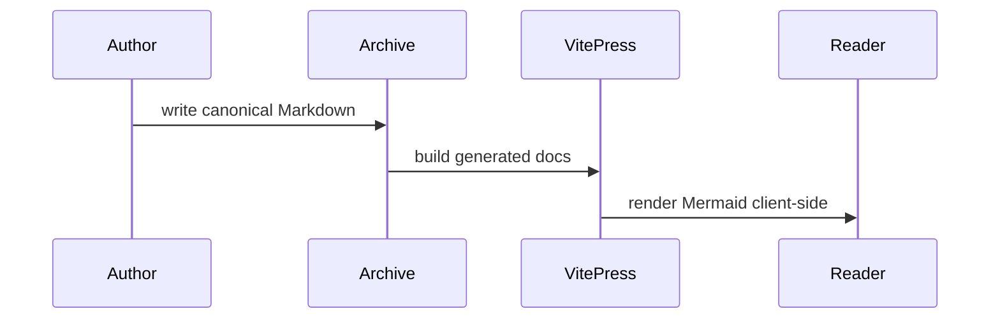

# Authoring Workflow

## Goal

Use this playbook when a human or agent needs to add or update canonical content in this repository.

If you want to run Archive from other directories or other projects, install and use the wrapper documented in `docs/cli.md`.

Canonical flow:

```text
incoming/ -> sources/ -> content/ -> site/
```

Rules:

- edit canonical content in `sources/`
- treat `content/`, `site/`, `.vitepress/nav.generated.ts`, `.vitepress/sidebar.generated.ts`, and `.vitepress/knowledge/*.generated.json` as generated output
- use `note` for smaller atomic knowledge entries
- use `doc` for larger structured documentation pages

## Supported Modes

Archive supports two authoring modes:

- standalone mode: run commands from the Archive repo with canonical content in that repo
- private workspace mode: run Archive against a separate private repo with `WORKSPACE=/path/to/private/repo` or from the private repo forwarding `Makefile`

Use standalone mode for the simplest local setup.
Use private workspace mode when canonical docs and notes should stay in private Git.

Canonical roots always live under `WORKSPACE`.
Generated `content/`, `site/`, and generated `.vitepress/*` output always live in the Archive tool repo.

The public repo ships a tiny optional starter corpus under `WORKSPACE/sources/notes/examples/` and `WORKSPACE/sources/docs/examples/` in standalone mode.
Delete those two directories and rebuild if you want a blank standalone corpus.
Private workspaces created with `make WORKSPACE=/path/to/private/repo init-workspace` do not include those examples.

## Choose a Workflow

Use `note` when the page should be small, reusable, and linkable as one focused unit.

Use `doc` when the page is a larger article, reference, guide, or architecture page.

Current workflow roots:

- `note`: `WORKSPACE/sources/notes/`
- `doc`: `WORKSPACE/sources/docs/`

Generated roots:

- `note`: `ARCHIVE_TOOL_ROOT/content/notes/`
- `doc`: `ARCHIVE_TOOL_ROOT/content/docs/`

## Choose an Entry Path

### Direct Canonical Authoring

Use this when you already know the target workflow and want to create a canonical source page immediately.

Example:

```sh
make new kind=note title="Docker DNS Issue" section=containers
```

Private workspace example:

```sh
make WORKSPACE=/path/to/private/repo new kind=note title="Docker DNS Issue" section=containers
```

You can scaffold common metadata at creation time:

```sh
make new \
  kind=doc \
  title="Homelab Firewall" \
  section=homelab/networking \
  slug=edge-firewall \
  nav_title="Edge Firewall" \
  summary="Firewall overview and operating notes." \
  priority=high \
  tags="firewall,homelab,networking" \
  related_manual="/docs/networking/dns-basics,/notes/homelab/router-checklist" \
  hide_backlinks=1
```

System-managed fields:

- `id`
- `created`
- `updated`
- default `status: draft`

### Intake and Review Flow

Use this when the starting Markdown is rough, imported, or LLM-generated and may need normalization before becoming canonical content.

Place the draft in `incoming/new/` with frontmatter such as:

```md
---
title: Docker DNS Issue
kind: note
section: containers
processing: auto
tags:
  - docker
  - dns
---
```

Then run:

```sh
make process-incoming
```

Private workspace example:

```sh
make WORKSPACE=/path/to/private/repo process-incoming
```

Processing behavior:

- `processing: auto` writes directly to `WORKSPACE/sources/...`
- `processing: review` writes to `WORKSPACE/incoming/review/...`

To accept a reviewed draft:

```sh
make accept-review file=incoming/review/example.md
```

The same command works from a private repo forwarding `Makefile`, or from the Archive repo with `WORKSPACE=/path/to/private/repo`.

## Common Frontmatter

Common author-controlled fields:

- `title`: full canonical page title and generated H1
- `slug`: optional stable route segment; lowercase letters, numbers, and hyphens only
- `nav_title`: optional compact label for sidebar and generated index pages
- `summary`: optional short description reused in generated indexes and the knowledge panel
- `tags`: optional list of tags
- `related_manual`: optional curated related routes such as `/docs/...` or `/notes/...`
- `hide_knowledge_panel`: optional boolean
- `hide_backlinks`: optional boolean
- `hide_related`: optional boolean
- `priority`: optional string

Route and navigation behavior:

- generated page URLs use `slug` when present
- sidebar and generated index labels use `nav_title` when present
- page bodies continue to use the full `title`

## Body Structure

Required sections by workflow:

- `note`: `Summary`, `Details`
- `doc`: `Overview`, `Details`

Optional sections:

- `note`: `Related`
- `doc`: `References`

Prefer keeping the required workflow structure intact even when the body is brief.

## Local Assets

For page-local images or files, keep a sibling asset folder next to the canonical source file:

```text
sources/docs/homelab/firewall.md
sources/docs/homelab/firewall.assets/
  topology.svg
```

Reference assets with ordinary relative Markdown paths:

```md

```

Build behavior:

- `make build-content` copies `<page-stem>.assets/` beside the generated page output
- if the page sets `slug`, the generated page filename may differ while the copied asset directory keeps the source file stem

## Mermaid Diagrams

Canonical Markdown may use plain Mermaid fences:

````md

````

Rules:

- do not replace Mermaid fences with manual Vue components in page content
- Mermaid rendering is handled by the local VitePress theme
- diagrams rerender on page navigation and dark/light mode changes

## Validate and Preview

After editing canonical content, use one of these loops:

Minimal validation:

```sh
make validate
```

Rebuild generated content only:

```sh
make build-content
```

Full static build:

```sh
make build
```

Background dev server:

```sh
make dev-bg
make dev-status
make dev-logs
make dev-stop
```

Full repository verification:

```sh
make check
```

## Recommended End-to-End Flows

### Human or Agent Creating a Canonical Page Directly

1. Choose `note` or `doc`.
2. Choose standalone mode or private workspace mode.
3. Run `make new ...` with any scaffoldable metadata. In private workspace mode, use `make WORKSPACE=/path/to/private/repo new ...` or run the command from the private repo wrapper `Makefile`.
4. Edit the generated source file under `sources/`.
5. Add any sibling `<page-stem>.assets/` folder if needed.
6. Add plain ` ```mermaid ` fences if diagrams help.
7. Run `make validate`.
8. Run `make build` or `make dev-bg`.

### Human or Agent Normalizing a Rough Draft

1. Put the draft in `incoming/new/`.
2. Set `kind` and `processing` in frontmatter.
3. Run `make process-incoming`. In private workspace mode, use `make WORKSPACE=/path/to/private/repo process-incoming` or run the command from the private repo wrapper `Makefile`.
4. If the result lands in `incoming/review/`, inspect it and run `make accept-review ...`.
5. Refine the canonical source under `sources/` if needed.
6. Run `make validate`.
7. Run `make build` or `make dev-bg`.
