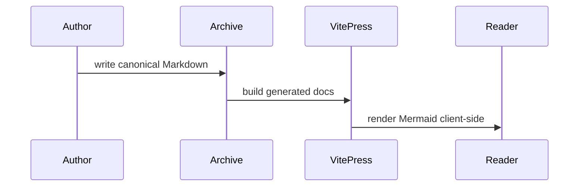

# Authoring Workflow

## Goal

Use this playbook when a human or agent needs to add or update canonical content in this repository.

If you want to run Archive from a workspace repo, other directories, or other projects, install and use the CLI documented in `docs/cli.md`.

Canonical flow:

```text
incoming/ -> sources/ -> content/ -> site/
```

Rules:

- edit canonical content in `sources/`
- treat generated content, site output, nav/sidebar data, and knowledge metadata as generated output
- use `note` for smaller atomic knowledge entries
- use `doc` for larger structured documentation pages

## Supported Modes

Archive supports two authoring modes:

- standalone mode: run commands from the Archive repo with canonical content in that repo
- workspace mode: run Archive against a separate repo with the installed `archive` CLI, `WORKSPACE=/path/to/workspace`, or the optional workspace repo forwarding `Makefile`

Use standalone mode for the simplest local setup.
Use workspace mode when canonical docs and notes should stay in a separate repo, whether that repo is private or public.

Canonical roots always live under `WORKSPACE`.
Generated output always lives in the Archive tool repo, either in the standalone root paths or under `.instances/<instance>/...` for workspace-instance runs.

The public repo ships a tiny optional starter corpus under `WORKSPACE/sources/notes/examples/` and `WORKSPACE/sources/docs/examples/` in standalone mode.
Delete those two directories and rebuild if you want a blank standalone corpus.
Workspace repos created with `archive init-workspace /path/to/workspace` do not include those examples.

## Choose a Workflow

Use `note` when the page should be small, reusable, and linkable as one focused unit.

Use `doc` when the page is a larger article, reference, guide, or architecture page.

Current workflow roots:

- `note`: `WORKSPACE/sources/notes/`
- `doc`: `WORKSPACE/sources/docs/`

Generated roots:

- `note`: `ARCHIVE_TOOL_ROOT/content/notes/`
- `doc`: `ARCHIVE_TOOL_ROOT/content/docs/`

## Choose an Entry Path

### Direct Canonical Authoring

Use this when you already know the target workflow and want to create a canonical source page immediately.

Example:

```sh
archive new note --title "Docker DNS Issue" --section containers
```

Workspace mode example:

```sh
archive new note --title "Docker DNS Issue" --section containers --workspace /path/to/workspace
```

You can scaffold common metadata at creation time:

```sh
archive new doc \
  --title "Homelab Firewall" \
  --section homelab/networking \
  --slug edge-firewall \
  --nav-title "Edge Firewall" \
  --summary "Firewall overview and operating notes." \
  --priority high \
  --tags "firewall,homelab,networking" \
  --related-manual "/docs/networking/dns-basics,/notes/homelab/router-checklist" \
  --hide-backlinks
```

System-managed fields:

- `id`
- `created`
- `updated`
- default `status: draft`

### Intake and Review Flow

Use this when the starting Markdown is rough, imported, or LLM-generated and may need normalization before becoming canonical content.

Place the draft in `incoming/new/` with frontmatter such as:

```md
---
title: Docker DNS Issue
kind: note
section: containers
processing: auto
tags:
  - docker
  - dns
---
```

Then run:

```sh
archive process
```

Workspace mode example:

```sh
archive process --workspace /path/to/workspace
```

Processing behavior:

- `processing: auto` writes directly to `WORKSPACE/sources/...`
- `processing: review` writes to `WORKSPACE/incoming/review/...`

To accept a reviewed draft:

```sh
archive accept incoming/review/example.md
```

The same command works from inside a workspace repo, or from elsewhere with `--workspace /path/to/workspace`.

## Common Frontmatter

Common author-controlled fields:

- `title`: full canonical page title and generated H1
- `section`: canonical lowercase slash-separated section path such as `homelab/security` or `kubernetes/omv`
- `slug`: optional stable route segment; lowercase letters, numbers, and hyphens only
- `nav_title`: optional compact label for sidebar and generated index pages
- `summary`: optional short description reused in generated indexes and the knowledge panel
- `tags`: optional list of tags; generated pages render them in the Context panel as links to generated `/tags/...` pages, and local search can target them directly with queries like exact `#proxmox`, prefix `#proxm*`, or tag-qualified text such as `#proxmox network`
- `related_manual`: optional curated related routes such as `/docs/...` or `/notes/...`
- `hide_knowledge_panel`: optional boolean
- `hide_backlinks`: optional boolean
- `hide_related`: optional boolean
- `priority`: optional string

Route and navigation behavior:

- generated page URLs use `slug` when present
- sidebar and generated index labels use `nav_title` when present
- page bodies continue to use the full `title`
- keep canonical `section` paths lowercase and stable; use workflow-local `_sections.yaml` overrides for display casing or sidebar collapse behavior

## Search Behavior

Archive extends VitePress local search with tag-aware queries without changing normal plain text search.

- `network`: normal full-text search with VitePress section anchors
- `#proxmox`: exact tag search for pages tagged `proxmox`
- `#proxmo*`: tag-prefix search for pages with tags starting with `proxmo`
- `#proxmox network`: page-level results that match both the `proxmox` tag and `network`
- `#proxmo* network`: page-level results that match the tag prefix and `network`

Hashtag searches intentionally return page URLs instead of section anchors because the match comes from page metadata. Plain text searches still return the default section-level anchors when VitePress finds a matching section.

## Section Display Overrides

Section labels and default sidebar collapse behavior can be overridden per workflow with optional `_sections.yaml` files that live beside canonical content:

- `WORKSPACE/sources/docs/_sections.yaml`
- `WORKSPACE/sources/notes/_sections.yaml`

Example:

```yaml
sections:
  homelab:
    title: Homelab
    collapsed: false

  homelab/security:
    title: Security
    collapsed: true

  homelab/omv:
    title: OMV
    collapsed: true
```

Rules:

- `_sections.yaml` is workflow-wide, not page-local
- list only the paths you want to override; unlisted sections still work from document frontmatter
- `title` controls display text in the generated sidebar and workflow index headings
- `collapsed` controls the default fold state for that section group in the left sidebar
- top-level sections default to expanded; nested sections default to collapsed when no override is present
- in workspace mode, these files live in the workspace repo because `sources/` is canonical there

## Body Structure

Required sections by workflow:

- `note`: `Summary`
- `doc`: `Overview`

Optional sections:

- `note`: `Related`
- `doc`: `References`

Prefer keeping the required workflow structure intact even when the body is brief.

Writing guidance:

- one page should have one `#` heading only
- keep required workflow headings as `##` sections
- add more `##` headings after `Summary` or `Overview` for major sections when the page needs them
- do not place manual thematic breaks like `---`, `***`, or `___` immediately before a `##` heading; use the `##` heading itself as the section boundary
- use `###` for real subsections under those major `##` sections
- use `note` for atomic, reusable content such as a finding, command pattern, or focused troubleshooting page
- use `doc` for larger guides, reference pages, and architecture explanations
- `Summary` should state the note's takeaway quickly
- `Overview` should explain what the doc covers and when to use it
- `Details` is now optional; use `## Details` as a generic fallback when rough imported content has no clearer section structure yet
- `Related` and `References` are optional; include them only when they add real value

Split one page into multiple pages when:

- sections answer different questions
- sections would be useful as standalone links
- the page mixes unrelated guide, reference, and troubleshooting material

Keep one page when:

- the content serves one topic or one task
- the subsections are parts of the same explanation

## Linking and Backlinks

Use normal internal Archive links in the body when the prose naturally references another page:

```md
See [/docs/networking/dns-basics](/docs/networking/dns-basics).
```

Rules:

- backlinks are generated automatically from internal Archive links; do not hand-maintain backlink sections
- auto-related suggestions are generated from metadata and linking patterns
- use `related_manual` when two pages should be associated even if the body does not need an inline link
- do not use `related_manual` as a replacement for a normal in-body link when the current sentence directly depends on another page

Use this split:

- body link: when the current step, command, or explanation directly references another page
- `related_manual`: when the relationship is useful for discovery but not necessary to the prose

## Local Assets

For page-local images or files, keep a sibling asset folder next to the canonical source file:

```text
sources/docs/homelab/firewall.md
sources/docs/homelab/firewall.assets/
  topology.svg
```

Reference assets with ordinary relative Markdown paths:

```md

```

Build behavior:

- `archive build-content` copies `<page-stem>.assets/` beside the generated page output
- if the page sets `slug`, the generated page filename may differ while the copied asset directory keeps the source file stem

## Mermaid Diagrams

Canonical Markdown may use plain Mermaid fences:

````md

````

Rules:

- do not replace Mermaid fences with manual Vue components in page content
- Mermaid rendering is handled by the local VitePress theme
- diagrams rerender on page navigation and dark/light mode changes

## Validate and Preview

After editing canonical content, use one of these loops:

Minimal validation:

```sh
archive validate
```

Rebuild generated content only:

```sh
archive build-content
```

Full static build:

```sh
archive build
```

Background dev server:

```sh
archive dev-bg
archive dev-status
archive dev-logs
archive dev-stop
```

Full repository verification:

```sh
archive check
```

## Recommended End-to-End Flows

### Human or Agent Creating a Canonical Page Directly

1. Choose `note` or `doc`.
2. Choose standalone mode or workspace mode.
3. Run `archive new ...` with any scaffoldable metadata. In workspace mode, run it from inside the workspace repo or pass `--workspace /path/to/workspace`.
4. Edit the generated source file under `sources/`.
5. Add any sibling `<page-stem>.assets/` folder if needed.
6. Add plain ` ```mermaid ` fences if diagrams help.
7. Run `archive validate`.
8. Run `archive build` or `archive dev-bg`.

### Human or Agent Normalizing a Rough Draft

1. Put the draft in `incoming/new/`.
2. Set `kind` and `processing` in frontmatter.
3. Run `archive process`. In workspace mode, run it from inside the workspace repo or pass `--workspace /path/to/workspace`.
4. If the result lands in `incoming/review/`, inspect it and run `archive accept ...`.
5. Refine the canonical source under `sources/` if needed.
6. Run `archive validate`.
7. Run `archive build` or `archive dev-bg`.
